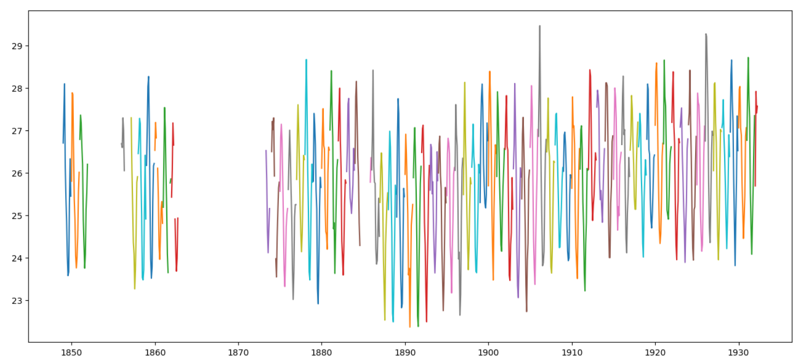
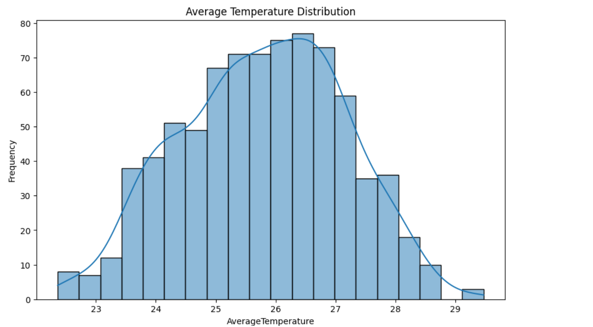
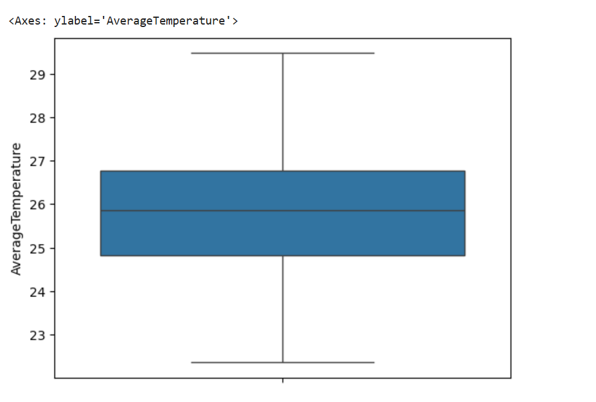

### EDA of Global Warming

Based on global warming report observation, graphs are plot to understand the increse of temperature over  time period,which average temperature is repatedly reported and to find out the potential Outliers

### Graph-1 : Trend Analysis

It helps us to know the pattern of temperature increase and the specific range of temperature at a given time

Based on the above graph, here are the following Data Analysis

Mid - late 19th century :

    Highest Recorded - 28-29 
    Lowest Recorded -  22-23

Early 20th century:

     Highest Recorded - Abobe 29(in 1906)
     
    Lowest Recorded -  24

Mid 20th century:

    Highest Recorded - Slighly 29
    
    Lowest Recorded -  24-25

### Graph-2 : Frequency Distribution

### Graph-3 : Potential Outliers

Boxplots were used to analyze spread, quartiles, and potential outliers.

Median temperature identified
IQR visualized using box region
Extreme observations detected as outliers

 
